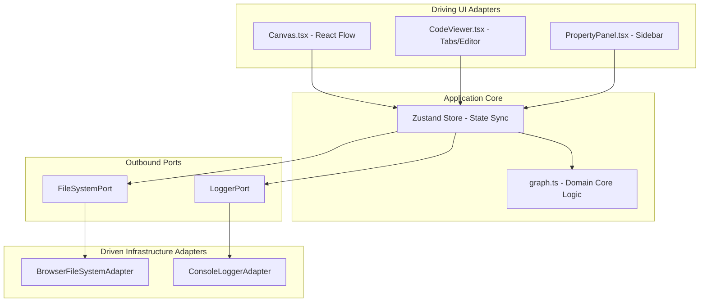

# Blueprint — Visual Systems Architecture Canvas

[](https://github.com/mzworthington/blueprint/actions/workflows/ci.yml)

Blueprint is a local-first, bi-directionally synchronized visual diagramming canvas designed to draft, validate, and persist systems architecture layouts. System maps are visual representations of a strict underlying YAML/JSON declarative schema, allowing designers to switch seamlessly between graphical composition and text configuration.

---

## 🚀 Key Features

- **Bi-directional Live Synchronization:** Move nodes or wire connections on the grid to instantly update the output YAML schema. Edit or paste YAML schema in the editor to immediately redraw the canvas layout.
- **Multi-File Workspace & System Switcher:** Eagerly loads all blueprints from the `blueprints/` directory. Provides an interactive glassmorphic dropdown switcher to swap seamlessly between different system diagrams.
- **Recursive C4 Zoom & Hierarchical Navigation:** Double-click on components referencing a sub-diagram (`c4Ref`) to zoom in. Navigate back up using the interactive Breadcrumbs trail or via `Escape`/`Backspace` shortcuts.
- **Circular Dependency Detection:** Runs real-time cycle validation (DFS traversal) over dependency links, highlighting offending visual edges in red and printing warnings.
- **Local-First Persistence:** Mounts directly to your local workspace files utilizing the native browser **File System Access API**, falling back gracefully to text downloads where unsupported.

---

## 🏛️ System Architecture



### 1. Pure Domain Layer (`src/domain/`)

The core domain has **zero dependencies** on external UI frameworks (React, React Flow, Zustand):

- [schema.ts](./src/domain/schema.ts): Houses types representing nodes, dependencies, properties, and verification results.
- [graph.ts](./src/domain/graph.ts): Implements validation, Zod parsers, cycle detection routines, and Mermaid.js flowchart exports.

### 2. Outbound Ports (`src/domain/ports.ts`)

Decoupled interfaces defining boundary operations for the core system:

- `FileSystemPort`: Manages saving and loading of system configuration files.
- `LoggerPort`: Manages structured trace logging.

### 3. Driven Adapters (`src/adapters/`)

Implementations of outbound ports binding visual tools to infrastructure resources:

- `BrowserFileSystemAdapter`: Interacts with the file system.
- `ConsoleLoggerAdapter`: Outputs structured timestamps and trace contexts to the browser console.
- `useBlueprintStore` (Zustand): Synchronizes component values, validates changes, and hooks up ports to the UI.

---

## 🔒 Security & Validation Architecture

To enforce a zero-trust model at boundaries, Blueprint employs a two-tier validation approach:

1. **Syntactic & Sanitization Schema Check (Zod):**
   When YAML code is loaded, the parser validates it against a strict Zod contract:
   - Node IDs are validated against `/^[a-zA-Z0-9_-]+$/` to ensure they are alphanumeric, preventing XSS, space errors, or SQL injection vectors.
   - Node type strings must match valid domain enums (e.g. `rest-api`, `grpc-service`, `event-broker`, `relational-database`).
2. **Structural & Architectural Dependency Check (DFS):**
   Once syntax is confirmed, the graph validator evaluates constraints:
   - Transitive circular dependency loops are flagged (`gateway` ➔ `service-a` ➔ `service-b` ➔ `gateway`).
   - Active cyclic paths are visually highlighted on the UI canvas by blinking/animating corresponding edge routes.

---

## 🛠️ Setup & Local Development

### Prerequisites

- **Node.js:** `v20.x` or later
- **pnpm:** `v10.x` or later

### 1. Install Dependencies

```bash
pnpm install
```

### 2. Run Local Development Server

Launches the Vite server with Hot Module Replacement (HMR) and Tailwind compilation:

```bash
pnpm dev
```

### 3. Build Production Artifacts

Compiles type definitions and generates the minified production bundle in the `dist` directory:

```bash
pnpm build
```

### 4. Auto-Generate System Diagrams (AST Analyzer)

Parses your local TypeScript/React codebase, extracts components and dependency relationships, calculates optimal visual grid coordinates with Dagre, and outputs a capitalized system schema file inside the `blueprints/` directory (e.g. `blueprints/my-system.yaml`):

```bash
pnpm analyze
```

---

## 🧪 Testing Environment, Code Style & Quality Control

### Running Tests

Run the entire Vitest suite:

```bash
pnpm test
```

### Formatting

Run Prettier validation:

```bash
pnpm format:check
```

Apply automatic formatting to all source files:

```bash
pnpm format:write
```

### Git Commit Hooks

We use **Husky** and **lint-staged** to automatically intercept commits:

- Only modified files are processed.
- Before committing, files undergo automated format fixing (`prettier --write`) and lint verification (`oxlint -c .oxlintrc.json`).
- If lint errors or syntax failures are detected, the commit is aborted.
