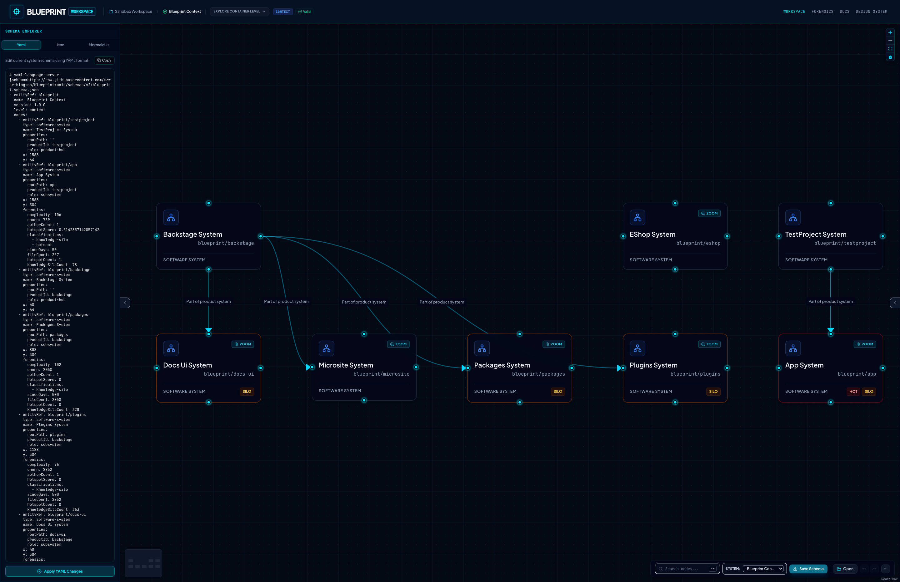

# Blueprint — Visual Systems Architecture Canvas

[](https://github.com/mzworthington/blueprint/actions/workflows/ci.yml) [](https://github.com/mzworthington/blueprint/actions/workflows/codeql.yml)

Blueprint is a local-first, bi-directionally synchronized visual diagramming canvas designed to draft, validate, and persist systems architecture layouts. System maps are visual representations of a strict underlying YAML/JSON declarative schema, allowing designers to switch seamlessly between graphical composition and text configuration.

---

## 📸 The Blueprint App



A front-end visual canvas web application client. Double-click boundary nodes to drill down into C4 container/component levels and edit schemas side-by-side with code-viewer synchronization.

👉 **Learn more:** [app/packages/designer/README.md](./app/packages/designer/README.md)

---

## 💻 The Blueprint CLI Tool


A powerful command-line static analysis (AST) code scanner written in Rust. It parses source files, identifies components and dependency references, formats an optimal coordinate layout using a grid layout, and outputs a valid system schema YAML configuration.

👉 **Learn more:** [cli/README.md](./cli/README.md)

---

## 📦 Workspace Component Catalog

This repository is organized into distinct subdirectories:

| Component                 | Path                                               | Language/Framework                     | Description                                                   |
| :------------------------ | :------------------------------------------------- | :------------------------------------- | :------------------------------------------------------------ |
| **`@blueprint/designer`** | [app/packages/designer/](./app/packages/designer/) | TypeScript / React / Vite / React Flow | Front-end visual diagramming client (Playwright E2E, Vitest)  |
| **`blueprint`**           | [cli/](./cli/)                                     | Rust / Clap / Tree-Sitter / Prost      | CLI static analysis AST scanner & standalone binary generator |
| **`core-proto`**          | [core/proto/](./core/proto/)                       | Protocol Buffers (v3)                  | Shared declarative schemas defining system diagrams           |

---

## 🛠️ Development & Build Commands

Since this is a multi-language codebase, commands are run in their respective component directories:

### 🎨 Visual Frontend Web Application (`/app`)

Navigate to the `/app` directory to manage Node dependencies and development:

```bash
cd app

# Install dependencies
pnpm install

# Start the Vite React development server
pnpm dev

# Build the production assets
pnpm build

# Run linters (Oxlint) & code formatting checks (Prettier)
pnpm lint
pnpm format:check

# Execute front-end unit tests (Vitest + JSDOM)
pnpm test

# Run Playwright E2E tests
pnpm test:e2e
```

### 🦀 Rust Static Analyzer CLI (`/cli`)

Navigate to the `/cli` directory to run or build the scanner:

```bash
cd cli

# Run the analyzer CLI interactively during development
cargo run

# Run with headless configuration arguments
cargo run -- --headless --glob="src/**/*.ts" --output="blueprints"

# Compile the release binary (generated at target/release/blueprint)
cargo build --release

# Run Rust unit/integration tests
cargo test
```

---

## 📖 Deep-Dive Documentation

Explore these files under the `docs/` directory to learn more:

- **[E2E Journeys & Interface Tour](./docs/journeys.md):** Detailed step-by-step guides, screenshots, and C4 visualization tours.
- **[System Architecture & Security](./docs/architecture.md):** Hexagonal structure layers, Zustand state store slices, schema validation rules, and cyclic dependency checkers.
- **[Setup & Local Development](./docs/setup.md):** Complete guide to tools installation (Mise), compiling standalone executables, and pre-commit Git validation hooks.
