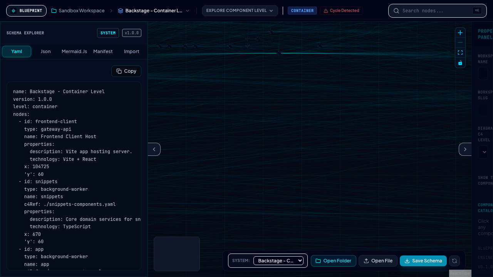

# Blueprint — Visual Systems Architecture Canvas

[](https://github.com/mzworthington/blueprint/actions/workflows/ci.yml)

Blueprint is a local-first, bi-directionally synchronized visual diagramming canvas designed to draft, validate, and persist systems architecture layouts. System maps are visual representations of a strict underlying YAML/JSON declarative schema, allowing designers to switch seamlessly between graphical composition and text configuration.

---

## 📸 The Blureprint App



---

## 💻 The Blueprint CLI Product

Blueprint includes a powerful command-line interface (CLI) to automatically generate system diagrams directly from your existing application codebases.

The CLI works as an **AST Analyzer**. It parses your local source code, extracts components and dependency relationships, calculates an optimal coordinate layout using Dagre, and outputs a valid system schema YAML file inside the `blueprints/` directory.

### Running the Analyzer

To scan your codebase, run the following command in the repository root:

```bash
pnpm blueprint
```

### CLI Execution Modes

1. **Interactive Mode (Default):**
   When run inside an interactive terminal, the CLI will walk you through a step-by-step prompt menu powered by `@clack/prompts`:
   - Select your preferred parser (e.g., `ts-morph` or `tree-sitter`).
   - Define the glob pattern to scan (supporting Tab autocompletion).
   - Define the output directory path.

2. **Headless / CI Mode:**
   The CLI automatically switches to headless mode when executed in a non-TTY terminal, standard CI environments, or when arguments are supplied directly:
   ```bash
   pnpm blueprint --headless --parser=ts-morph --glob="src/**/*.ts" --output="blueprints"
   ```

### Command Options & Flags

- `--headless`: Explicitly disables interactive console prompts.
- `--parser=<ts-morph | tree-sitter>`:
  - `ts-morph` (default): Fast, lightweight parsing for TypeScript-focused projects.
  - `tree-sitter`: High-performance parsing supporting multi-language syntaxes.
- `--glob="<pattern>"`: The directory or glob matching query to scan (e.g., `**/*.{ts,tsx}`).
- `--output="<path>"`: The folder to store generated YAML blueprint files. You can also configure this by setting the `BLUEPRINT_OUTPUT_DIR` environment variable.

### Compiling to a Standalone Binary

You can compile the analyzer CLI tool into a single standalone executable binary using Bun:

```bash
pnpm blueprint:compile
```

This generates `dist/blueprint-cli` which can be executed directly:

```bash
./dist/blueprint-cli --headless --parser=ts-morph
```

> [!NOTE]
> The standalone binary requires tree-sitter `.wasm` query files (found in `node_modules/tree-sitter-wasms/out/`) in either the same directory as the executable, or in the target project's `node_modules` directory for parser support.

---

## 📖 Detailed Documentation

Explore these dedicated files to learn more about using, designing, or contributing to Blueprint:

- **[E2E Journeys & Interface Tour](./docs/journeys.md):** Screenshots and workflows detailing UI panels, container navigation, and visual editing.
- **[System Architecture & Security](./docs/architecture.md):** Deep-dive into domain layers, state store slices, outbound ports, Zod schemas, and circular dependency detection algorithms.
- **[Setup & Local Development](./docs/setup.md):** Guide to configuring Mise, installing package dependencies, executing tests (Vitest/Playwright), and configuring Git pre-commit validation hooks.
