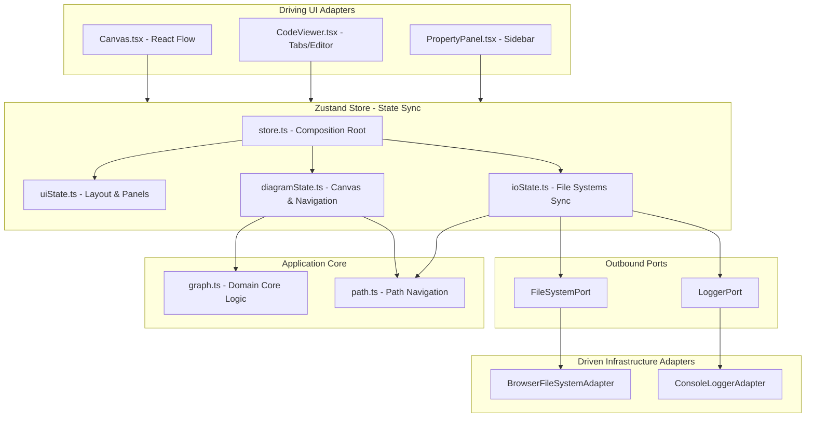

# System Architecture & Security

This document covers the high-level system architecture, dependency flow, module responsibilities, and validation boundaries of Blueprint.

---

## 🏛️ System Architecture Diagram

The design of Blueprint adheres to a modular composition where driving adapters (UI views) interact with a central Zustand store, which delegates complex operations to a pure domain layer and communicates out-of-process via decoupled ports:

---

## 🧱 Architectural Components

### 1. Pure Domain Layer (`src/domain/`)

The core domain contains business validation logic and has **zero dependencies** on external UI frameworks (React, React Flow, Zustand):

- [schema.ts](../src/domain/schema.ts): Houses types representing nodes, dependencies, properties, and verification results.
- [graph.ts](../src/domain/graph.ts): Implements validation, Zod parsers, cycle detection routines, and Mermaid.js flowchart exports.
- [path.ts](../src/domain/path.ts): Handles filesystem-agnostic relative C4 path resolution and closest workspace manifest matching.

### 2. Outbound Ports (`src/domain/ports.ts`)

Decoupled interfaces defining boundary operations for the core system:

- `FileSystemPort`: Manages saving and loading of system configuration files.
- `LoggerPort`: Manages structured trace logging.

### 3. Driven Adapters (`src/adapters/`)

Implementations of outbound ports binding visual tools to infrastructure resources:

- `BrowserFileSystemAdapter`: Interacts with the file system.
- `ConsoleLoggerAdapter`: Outputs structured timestamps and trace contexts to the browser console.
- `useBlueprintStore` (Zustand): Synchronizes component values, validates changes, and hooks up ports to the UI. Composed of modular states:
  - `UiState`: Manages sidebar and panel toggles.
  - `DiagramState`: Manages canvas visual nodes/edges and zoom transitions.
  - `IoState`: Manages directory and file writing/reading interfaces.
- `layoutUtils.ts`: Handles stateless React Flow node/edge coordinate converters and handle styling anchors.
- `defaultData.ts`: Eagerly compiles blueprints glob matching files at build time.

---

## 🔒 Security & Validation Architecture

To enforce a zero-trust model at boundaries, Blueprint employs a two-tier validation approach:

### 1. Syntactic & Sanitization Schema Check (Zod)

When YAML/JSON code is loaded, the parser validates it against a strict Zod contract:

- Node IDs are validated against `/^[a-zA-Z0-9_-]+$/` to ensure they are alphanumeric, preventing XSS, space errors, or script injection vectors.
- Node type strings must match valid domain enums (e.g. `rest-api`, `grpc-service`, `event-broker`, `relational-database`).

### 2. Structural & Architectural Dependency Check (DFS)

Once syntax is confirmed, the graph validator evaluates constraints:

- Transitive circular dependency loops are flagged (`gateway` ➔ `service-a` ➔ `service-b` ➔ `gateway`).
- Active cyclic paths are visually highlighted on the UI canvas by blinking/animating corresponding edge routes.
