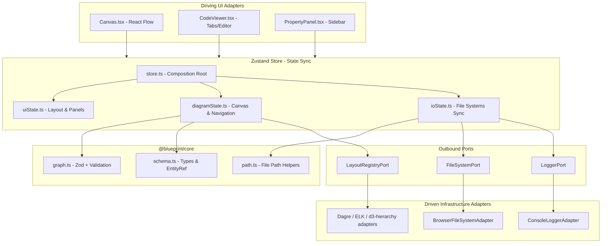
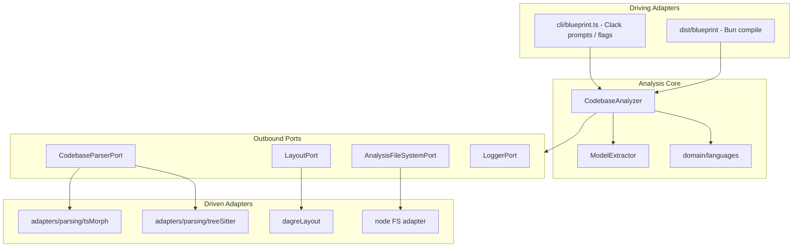

# System Architecture & Security

This document covers the high-level system architecture, dependency flow, module responsibilities, and validation boundaries of Blueprint.

---

## Web Application Architecture

The designer adheres to Hexagonal Architecture: UI adapters talk to a Zustand store, which uses pure domain rules from `@blueprint/core` and talks to the browser via ports/adapters.

---

## TypeScript CLI Architecture

The production CLI is `@blueprint/cli` under `app/packages/cli/` (TypeScript / Bun). It uses hexagonal ports for parsing, layout, filesystem, and logging, and depends on `@blueprint/core` for shared types and `EntityRef` helpers.

Folder map: `src/cli/` (entry), `src/analysis/{domain,adapters}` (with `languages/` and `parsing/` / `pathFilter/` subgroups), `src/forensics/`, `src/writers/`. See `@blueprint/cli` README “Source layout”.

### Web-to-CLI filesystem bridge

1. The **TypeScript CLI** writes YAML under `blueprints/`.
2. The **designer** loads those files (bundled defaults or an opened folder) via the Browser File System Access API.

> Experimental Rust sources under `/cli` are unmaintained and not part of the production pipeline.

---

## Architectural Components

### 1. Pure Domain Layer (`app/packages/core/src/`)

Shared by designer and CLI. TypeScript + Zod — no Protocol Buffers.

- **[schema.ts](../app/packages/core/src/models/schema.ts):** Domain types, `EntityRef` helpers, validation result types.
- **[graph.ts](../app/packages/core/src/rules/graph.ts):** Zod contracts, cycle detection, YAML/JSON parse & serialize, Mermaid export.
- **[path.ts](../app/packages/core/src/rules/path.ts):** Filesystem-agnostic relative path helpers for multi-file IO.
- **[entityRef.ts](../app/packages/core/src/lib/entityRef.ts):** Workspace FQN resolution. Hierarchy: child `schema.entityRef` equals parent node `entityRef`.

### 2. Designer ports (`app/packages/designer/src/core/models/ports.ts`)

- `FileSystemPort` / `WorkspacePort`: load and save schemas and directories.
- `LoggerPort`: structured logging.
- `LayoutRegistryPort` / `LayoutEnginePort`: client-side graph layout engines (dagre, ELK, d3-hierarchy).

### 3. Designer adapters & store (`app/packages/designer/src/`)

- `infrastructure/fileSystem/` — browser FS Access adapters.
- `infrastructure/layout/` — graph layout adapters + `createBrowserLayoutRegistry` (engines lazy-loaded on first use).
- `infrastructure/db/` — IndexedDB working copy / baseline diffs.
- `application/layout/` — pure layout use-case (`computeClientLayout`) and grid policy.
- `application/store/` — Zustand composition (`uiState`, `diagramState`, `ioState`).

### 4. TypeScript CLI (`app/packages/cli/src/`)

- `blueprint.ts` — entry / prompts.
- `analysis/domain/` — analyzer, language strategies, model extraction.
- `writers/` — context / container / component YAML writers.

---

## Security & Validation

### 1. Syntactic schema check (Zod)

YAML/JSON is validated against shared Zod contracts in `@blueprint/core`:

- Entity refs match `ENTITY_REF_PATTERN` (no path-style ids).
- Node types must match domain enums.

### 2. Structural dependency check (DFS)

- Circular dependency loops are flagged and highlighted on the canvas.
