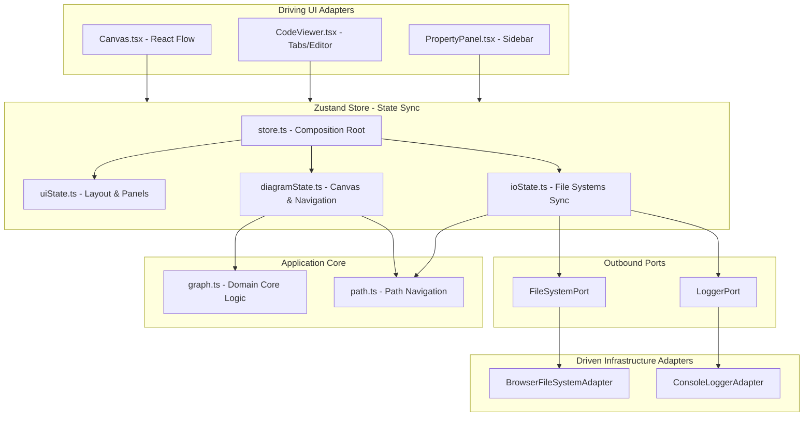
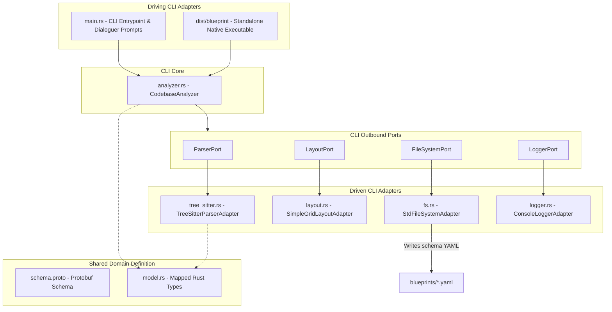

# System Architecture & Security

This document covers the high-level system architecture, dependency flow, module responsibilities, and validation boundaries of Blueprint.

---

## 🏛️ Web Application Architecture Diagram

The design of Blueprint's visual client adheres to Hexagonal Architecture, where driving adapters (UI views) interact with a central Zustand store, which delegates complex operations to a pure domain layer and communicates out-of-process via decoupled ports:

---

## 💻 CLI AST Analyzer Architecture Diagram

The CLI package (`packages/cli/`) is written in Rust and uses a decoupled hexagonal architecture to process local codebases, calculate coordinates, and output YAML blueprint files:

### 🤝 Web-to-CLI Filesystem Bridge

The two systems are bridged via the filesystem:

1. The **Rust CLI AST Analyzer** outputs computed diagram schemas as static YAML files into the local `blueprints/` folder.
2. The **Web Application** requests/watches this `blueprints/` directory using the Browser File System Access API (via `BrowserFileSystemAdapter`) to live-render the layouts.

---

## 🧱 Architectural Components

### 1. Pure Domain Layer (`packages/core/src/`)

The core domain contains business validation logic, is shared between the TS React application and Rust CLI (using Protocol Buffers), and has **zero dependencies** on external UI frameworks:

- **[schema.proto](../packages/core/proto/blueprint/v1/schema.proto):** Shared Protocol Buffers systems architecture schema serving as the source of truth for both packages.
- **[schema.ts](../packages/core/src/models/schema.ts):** Houses types representing nodes, dependencies, properties, and verification results. Maps generated protobuf schemas to Zod contracts.
- **[graph.ts](../packages/core/src/rules/graph.ts):** Implements validation, Zod parsers, cycle detection routines, and Mermaid.js flowchart exports.
- **[path.ts](../packages/core/src/rules/path.ts):** Handles filesystem-agnostic relative C4 path resolution and closest workspace manifest matching.

### 2. Outbound Ports (`packages/core/src/models/ports.ts`)

Decoupled interfaces defining boundary operations for the core system:

- `FileSystemPort`: Manages saving and loading of system configuration files.
- `LoggerPort`: Manages structured trace logging.

### 3. Driven Adapters (`packages/app/src/adapters/`)

Implementations of outbound ports binding visual tools to infrastructure resources:

- `BrowserFileSystemAdapter`: Interacts with the file system.
- `ConsoleLoggerAdapter`: Outputs structured timestamps and trace contexts to the browser console.
- `useBlueprintStore` (Zustand): Synchronizes component values, validates changes, and hooks up ports to the UI. Composed of modular states:
  - `UiState`: Manages sidebar and panel toggles.
  - `DiagramState`: Manages canvas visual nodes/edges and zoom transitions.
  - `IoState`: Manages directory and file writing/reading interfaces.
  - `layoutUtils.ts`: Handles stateless React Flow node/edge coordinate converters and handle styling anchors.
  - `defaultData.ts`: Eagerly compiles blueprints glob matching files at build time.

### 4. CLI AST Analyzer Core & Adapters (`packages/cli/src/`)

- **[main.rs](../packages/cli/src/main.rs):** CLI adapter entry point. Handles interactive prompts (`dialoguer`) or headless CLI flags and activates the analyzer.
- **[analyzer.rs](../packages/cli/src/domain/analyzer.rs):** Central orchestrator of the codebase analyzer pipeline.
- **[ports.rs](../packages/cli/src/domain/ports.rs):** Outbound ports specifying parsing (`ParserPort`), layout (`LayoutPort`), file system (`FileSystemPort`), and logger (`LoggerPort`) interfaces.
- **[tree_sitter.rs](../packages/cli/src/infrastructure/parser/tree_sitter.rs):** Driven parsing adapter utilizing native tree-sitter language libraries.
- **[fs.rs](../packages/cli/src/infrastructure/fs.rs):** Driven file system adapter using standard I/O library and `serde_json`/`serde_yaml` serializations.

---

## 🔒 Security & Validation Architecture

To enforce a zero-trust model at boundaries, Blueprint employs a two-tier validation approach:

### 1. Syntactic & Sanitization Schema Check (Zod)

When YAML/JSON code is loaded, the parser validates it against a strict Zod contract:

- Node IDs are validated against `/^[a-zA-Z0-9_-]+$/` to ensure they are alphanumeric, preventing XSS, space errors, or script injection vectors.
- Node type strings must match valid domain enums (e.g. `rest-api`, `grpc-service`, `event-broker`, `relational-database`).

### 2. Structural & Architectural Dependency Check (DFS)

Once syntax is confirmed, the graph validator evaluates constraints:

- Transitive circular dependency loops are flagged (`gateway` ➔ `service-a` ➔ `service-b` ➔ `gateway`).
- Active cyclic paths are visually highlighted on the UI canvas by blinking/animating corresponding edge routes.
