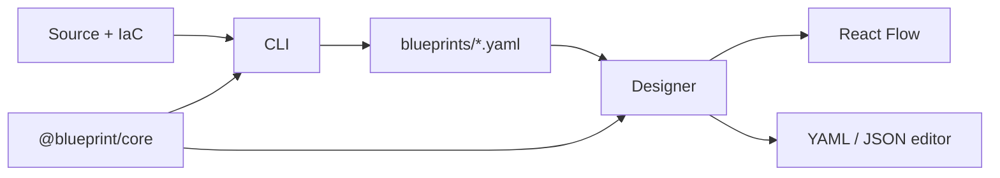

# Blueprint Codebase Review & Improvement Suggestions

Blueprint is a **local-first C4 architecture platform** with three well-separated packages: `@blueprint/designer` (React PWA canvas), `@blueprint/cli` (AST + IaC scanner), and `@blueprint/core` (canonical `SystemSchema`, parsers, merge logic). The canonical format is YAML linked by `entityRef`; Mermaid and layout are projections, not sources of truth.

The product is mature in its core loop — **scan → visualize → edit → commit drafts** — with 600+ passing unit tests and strong hexagonal boundaries. Below is a feature inventory and prioritized improvement suggestions.

---

## What Exists Today

| Area         | Capabilities                                                                                                                                                                                                                  |
| ------------ | ----------------------------------------------------------------------------------------------------------------------------------------------------------------------------------------------------------------------------- |
| **Designer** | C4 canvas with drill-down, bi-directional YAML sync, undo/redo, drag-and-drop catalog, 3 layout engines, Mermaid import wizard, external dependency proxies, forensics heatmap/coupling focus, IndexedDB drafts + diff commit |
| **CLI**      | Polyglot AST (TS, C#, Python via tree-sitter), monorepo discovery, git forensics enrichment, Terraform IaC pass, **Pulumi IaC pass (in progress)**                                                                            |
| **Core**     | Zod validation, `schemaMerge`, `mermaidImport`, shared `infraIr` for Terraform/Pulumi, workspace externals                                                                                                                    |



---

## Strengths Worth Preserving

1. **Import direction is correct** — external diagrams enter via wizards with merge preview; populated workspaces are never wholesale-replaced.
2. **Shared IaC IR** — `infraIr` + `infraSchemaMap` let Terraform and Pulumi converge on the same node-type mapping (`iacResourceMap`), reducing duplication.
3. **Forensics as enrichment, not a side report** — metrics live on `node.forensics` and roll up through the C4 hierarchy, which keeps the product focused on architecture, not dashboards.
4. **Test discipline** — domain logic in core is well-covered; designer tests exercise real store workflows.

---

## Suggested Improvements

### 1. Finish the Pulumi pass (near-term, in-flight)

Pulumi is wired end-to-end with tests but **not documented** — `docs/guide/cli.md` covers Terraform only.

**Do next:**

- Add a **Pulumi** section to the CLI guide (mirror Terraform: discovery rules, Infrastructure hub, output paths).
- Document supported runtimes (`yaml`, `nodejs` TypeScript) and known limits (e.g. Python/Go Pulumi discovered but lightly tested).
- Update README roadmap or feature inventory to list Pulumi alongside Terraform.

This is low effort and closes the gap between code and docs.

---

### 2. Unify IaC under one "Infrastructure import" abstraction

Terraform and Pulumi already share `infraIr` → `infraSchemaMap`. The next step is a **generic IaC import wizard** in the designer, reusing the Mermaid wizard pattern:

```
Paste/upload .tf / Pulumi.yaml / index.ts → parse via core → previewMergePlan → apply to active diagram
```

Today IaC only flows **CLI → disk → open folder**. A designer wizard would let teams:

- Import infra into an existing code architecture diagram
- Resolve conflicts when CLI re-scans overlap manual edits
- Onboard without running the CLI first

The merge infrastructure already exists in `schemaMerge.ts` and `previewMermaidImport`; the main work is a thin adapter over `parseTerraformBatchToSchema` / `parsePulumiBatchToSchema`.

---

### 3. Link code systems to infrastructure systems

The CLI already creates parallel hierarchies:

- **Product hub** for code monorepos
- **Infrastructure hub** for Terraform/Pulumi roots

What's missing is **cross-linking** — e.g. a `rest-api` container depending on an `aws_lambda_function` node, or a property like `deployedBy: infrastructure/prod-stack/api-lambda`.

**Suggestion:** Add optional `properties.iacRef` or dependency metadata that the CLI infers from:

- Shared naming (stack name ↔ package name)
- Explicit annotations in source (`@blueprint/iac-ref`)
- Pulumi/Terraform `tags` or `name` attributes matching `entityRef` slugs

This would make Blueprint meaningfully different from static diagram tools — a **live map of code ↔ deployed infra**.

---

### 4. Forensics expansion (roadmap items 2a–2b)

The README already lists churn trend charts and refactoring suggestions. You have the raw data (`churn`, `sinceDays`, `coupledFiles`, `hotspotScore`) but only scalar display today.

| Feature                    | Implementation sketch                                                                                                                           |
| -------------------------- | ----------------------------------------------------------------------------------------------------------------------------------------------- |
| **Churn sparklines**       | CLI already has git history access; emit `churnByWeek: number[]` on forensics during scan. Designer renders a small sparkline in PropertyPanel. |
| **Refactoring candidates** | Rank `complexity × churn × (1 - topAuthorPercent)` — surface on `/forensics` as a new filter tab alongside Hotspots/Silos.                      |
| **Coupling graph view**    | Temporal coupling is pairwise; a mini-graph of `coupledFiles` in the property panel would help navigate refactor boundaries.                    |

All three stay display-only (YAML unchanged), consistent with the heatmap pattern.

---

### 5. Git branch integration (roadmap item 3)

The designer's draft layer (IndexedDB → Pending Changes → disk write) is half of a Git workflow. Natural extensions:

- **Read-only branch indicator** — show current branch + dirty state when a workspace folder is open (via a small Git adapter port, similar to `FileSystemPort`).
- **Commit from Pending Changes** — after "Commit" writes YAML, offer "Create branch & commit" using `isomorphic-git` or a local helper CLI hook.
- **CI drift check** — `blueprint --headless` in CI, diff against committed `blueprints/`, fail on structural changes without an updated diagram.

The last item is especially valuable for teams treating diagrams as code review artifacts.

---

### 6. Expand IaC coverage

No references to CloudFormation, CDK, Bicep, Kubernetes, or Helm exist yet. Given the `infraIr` abstraction, expansion is incremental:

| Format                       | Approach                                                                  |
| ---------------------------- | ------------------------------------------------------------------------- |
| **AWS CDK / CloudFormation** | Parse synthesized `template.json` or CDK `*.template.yaml` → same IR      |
| **Kubernetes YAML**          | Map `kind: Deployment/Service/Ingress` → container/event-broker types     |
| **Helm**                     | Render or parse `values.yaml` + chart templates statically where possible |

Start with **CDK synth output** — many teams already commit or CI-generate CloudFormation JSON, which is easier to parse than TypeScript constructs.

---

### 7. Cross-diagram validation rules

Zod validates schema shape; cycle detection catches dependency loops. Consider a **rules engine** layer for architecture governance:

- "Every `relational-database` must have ≥1 inbound dependency from an application container"
- "No direct `person → database` edges at context level"
- "All `serverless-function` nodes must link to an IaC resource"

These fit naturally in `@blueprint/core` as pure functions over `SystemSchema`, surfaced as warnings in the designer header (alongside the existing validation badge). This positions Blueprint for **architecture review gates** in CI.

---

### 8. Mermaid export improvements

Mermaid import is shipped; export exists but is one-way by design. Useful enhancements without breaking the canonical-YAML rule:

- **C4 Mermaid dialect export** — many teams share diagrams in Confluence/Notion via Mermaid; richer C4 syntax (`C4Container`, etc.) would improve interoperability.
- **Export scope selector** — export active diagram vs. full workspace vs. selected subgraph.
- **Lossy export disclaimer** — already documented; a preview diff ("what won't round-trip") would set expectations.

---

### 9. CLI & language coverage

| Gap                                 | Suggestion                                                                                          |
| ----------------------------------- | --------------------------------------------------------------------------------------------------- |
| **Java / Go / Rust**                | tree-sitter grammars exist; add analyzer strategies following the C#/Python pattern                 |
| **Test classification**             | `testPath.ts` is a stub — framework detection (Jest, xUnit, pytest) would improve `isTest` accuracy |
| **Incremental scan**                | Re-scan only changed files (git diff) and merge into existing YAML — large monorepos would benefit  |
| **`--no-relayout` discoverability** | Document the re-scan workflow: preserve manual layout positions across CLI runs                     |

---

### 10. Designer UX polish

| Area                         | Idea                                                                                                              |
| ---------------------------- | ----------------------------------------------------------------------------------------------------------------- |
| **Startup chooser**          | Add "Scan with CLI" instructions + deep link to download; or a future "watch folder" mode                         |
| **Multi-system navigation**  | Breadcrumbs are strong; a **system map** mini-overview (context-level thumbnail grid) would help large workspaces |
| **Comparison mode**          | Diff two systems or two versions of the same `entityRef` side-by-side                                             |
| **Keyboard shortcuts panel** | Cmd+K search exists; document Esc, undo, panel toggles in a `?` overlay                                           |
| **Mobile**                   | `BreadcrumbsCompact` and `MobilePanelToggles` exist — worth an E2E pass on tablet viewports                       |

---

### 11. Documentation & onboarding

- **Pulumi docs** (immediate gap)
- **"Code + Infra" journey** — a `docs/journeys.md` entry showing scan a fullstack repo with `terraform/` and `Pulumi.yaml`
- **Architecture decision records** — optional `properties.adr` or link field on nodes for linking to ADRs
- **Remove or archive** the unmaintained Rust CLI (`cli/`) from the workspace table if it confuses new contributors

---

### 12. Technical debt / hygiene

- **Unknown IaC types** currently warn and default — consider a `properties.iacType` raw field so users can see unmapped provider types and contribute mappings.
- **Schema version pinning** — `setup.md` mentions v3; ensure CLI always writes the public schema URL and designer validates version mismatches on load.
- **E2E for Pulumi/Terraform** — Mermaid has screenshot E2E; IaC CLI output could have a golden-file test against a fixture repo.

---

## Prioritized Roadmap

| Priority | Item                                           | Effort       | Impact                        |
| -------- | ---------------------------------------------- | ------------ | ----------------------------- |
| **P0**   | Document Pulumi in CLI guide                   | Small        | Closes in-flight work         |
| **P1**   | Designer IaC import wizard (reuse merge infra) | Medium       | Parity with Mermaid import    |
| **P1**   | Code ↔ infra cross-linking in CLI              | Medium       | Unique product differentiator |
| **P2**   | Forensics sparklines + refactor ranking        | Medium       | Delivers roadmap §2           |
| **P2**   | CI drift check (`blueprint --headless` + diff) | Small–Medium | Enterprise adoption           |
| **P3**   | CDK/K8s IaC parsers                            | Large        | Broader IaC coverage          |
| **P3**   | Architecture governance rules engine           | Medium       | Review-gate workflows         |
| **P3**   | Git branch commit from designer                | Large        | Roadmap §3                    |

---

## Bottom Line

Blueprint has a clear architectural identity: **YAML-first C4 with automated discovery and forensic enrichment**. The strongest near-term wins are finishing Pulumi (docs + any runtime gaps), bringing IaC into the designer via the existing merge wizard pattern, and linking code diagrams to infrastructure diagrams — that combination would be hard for generic diagramming tools to replicate.
