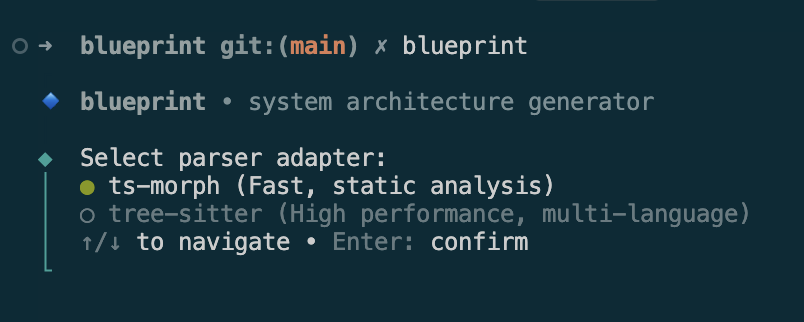

# CLI analysis

The TypeScript CLI (`@blueprint/cli`) scans source, discovers systems, extracts components and dependencies, lays them out with Dagre, and writes multi-level blueprint YAML.



## Modes

1. **Interactive** — prompts for parser, glob, output, and git forensics
2. **Headless** — flags or non-TTY / CI; suitable for automation

```bash
blueprint --headless --parser=ts-morph --glob="**/*.{ts,tsx}" --output="blueprints"
```

Install the release binary first: [Getting started](./getting-started.md).

## Useful flags

| Flag                               | Purpose                        |
| ---------------------------------- | ------------------------------ |
| `--headless`                       | No prompts                     |
| `--parser=ts-morph \| tree-sitter` | AST engine                     |
| `--glob`                           | Inclusion pattern              |
| `--output`                         | Output folder                  |
| `--context`                        | Context / root name            |
| `--ignore`                         | Extra ignore globs (csv)       |
| `--systems`                        | Limit discovery to roots       |
| `--rollup-modules`                 | Collapse `*-module-*` packages |
| `--git` / `--no-git`               | Forensics on (default) or off  |
| `--git-since=<days>`               | Lookback window (default 90)   |

Full flag table and config: see the [CLI README](https://github.com/mzworthington/blueprint/blob/main/app/packages/cli/README.md).

## Deliverable

YAML under the output directory — **not** a separate forensics report. Architecture graphs are the product; forensics attach onto `node.forensics` when enabled.

## Cancellation

**Ctrl+C** (or SIGTERM) aborts cooperatively; a second signal force-exits.

## Next

- [Git forensics](./forensics.md)
- [Architecture & security](../architecture.md)
