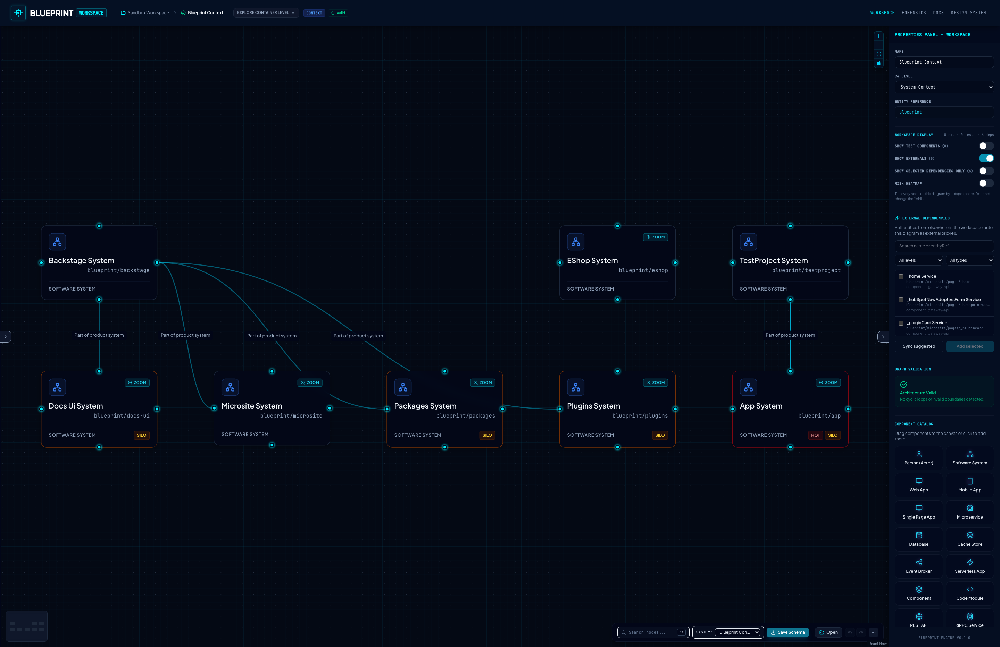

# Interface Tour & E2E Journeys

This page walks you through the core visual components and typical end-to-end (E2E) user journeys in Blueprint.

Screenshots under `docs/screenshots/` are refreshed by the designer Playwright suite (`pnpm test:e2e` in `app/packages/designer`).

---

## 📸 Visual Tour

### 1. Expanded Workspace Properties & Catalog

Shows the default view with sidebar panels expanded, exposing properties and the active catalog components.

### 2. Clean Diagram Canvas View

Collapses the panels to present a distraction-free, maximized view of the diagram canvas.

### 3. Hierarchical C4 Container Level

Visualizes container relationships and boundaries at the C4 Container level of abstraction.

### 4. Recursive Zoom-In Components

Allows designers to inspect internal details by double-clicking nodes whose `entityRef` matches a child diagram's schema identity.

### 5. Zoom Back to Context

After drilling into containers and components, Escape (or breadcrumbs) returns you to the context diagram.

### 6. Startup Workspace Chooser

On bare `/workspace`, choose how to begin: bundled sandbox, a local `blueprints/` folder, or Mermaid import onto a blank canvas.

### 7. Import Mermaid Merge Preview

Paste or upload Mermaid (flowchart or C4). The wizard shows a rendered preview, additions, and conflict resolutions before merging into the active diagram.

### 8. Workspace Display & External Dependencies

**Workspace display** toggles tests, externals, selected-dependencies-only, and the risk heatmap (with live counts). **External Dependencies** pulls entities from other schemas in the workspace onto the current diagram as proxies.

---

## 🏃 Key User Journeys

### 1. Opening a workspace

- Visit `/workspace` and pick **Load sandbox**, **Open workspace from directory**, or **Import Mermaid diagram**.
- Deep links such as `/workspace/blueprint` skip the chooser and load the matching diagram.
- Later: use the toolbar **Open** menu for folder, file, or Mermaid import again.

### 2. Synchronizing Canvas & Schema

- **Visual-to-Text:** Select nodes or drag/wire connections on the canvas. The underlying YAML/JSON schema auto-updates in real time.
- **Text-to-Visual:** Open the built-in editor, paste or edit system schemas, and watch the visual canvas immediately redraw.
- Edits stay in an IndexedDB draft until you **Commit** via Pending Changes (or **Revert** to the disk baseline).

### 3. Recursive Level Navigation

- Double-click a node that has a nested diagram (child schema `entityRef` equals the node `entityRef`) to zoom into container/component levels.
- Press `Escape`, use the zoom-out control, or click breadcrumbs to navigate back up.

### 4. Import Mermaid into the active diagram

- Open **Import Mermaid** from the startup chooser or the **Open** menu.
- Paste Mermaid (or upload `.mmd` / `.md`). Review additions and resolve conflicts (keep / rename / overwrite).
- **Merge into diagram** applies a draft merge and runs ELK layout. Commit via Pending Changes when ready.
- The Code Viewer Mermaid tab remains export-only — editing happens through the import wizard.

### 5. Focus dependencies & externals

- Under **Workspace display**: show/hide test nodes and external proxies, or limit edges to the selected node’s dependencies.
- Use **External Dependencies** to search the loaded workspace and add (or sync suggested) external proxies onto the current diagram.

### 6. Multi-File Workspace Swaps

- The workspace loads all declarative system schemas located under the local `blueprints/` folder.
- Use the system switcher in the header to toggle between different system layouts instantly.
