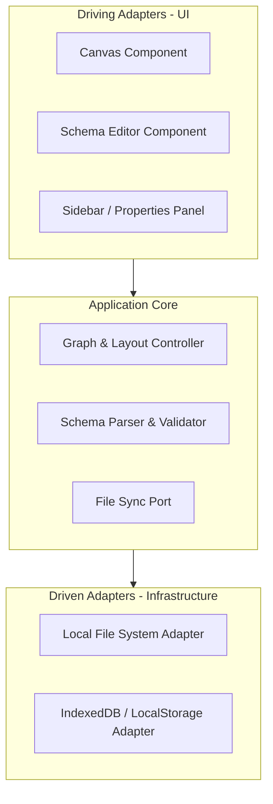

# Blueprint Implementation Plan

Blueprint is a local-first, interactive visual canvas designed for software architects and platform engineers to design and version-control system architectures. It synchronizes a graphical node canvas with a structured code schema bi-directionally.

## User Review Required

> [!IMPORTANT]
> Since we are starting the project from scratch, we must establish the core technology selections. We suggest starting with a **Vite + React + TypeScript** setup for maximum performance, minimal build overhead, and pure local-first capability.

## Open Questions

> [!NOTE]
> Please review these foundational design choices before we initialize the codebase.

1. **Framework Choice:** Do you prefer initializing the application with **Vite (React + TypeScript)** or **Next.js (App Router)**? 
   - *Recommendation:* **Vite**, because Blueprint is designed as a browser-sandboxed local-first dashboard. A client-side build is lightweight and can be fully exported to static hosting or run offline. Yes, good choice
2. **Visual Engine / Graph Library:** Should we use **React Flow (v11/v12)** or construct a **Custom SVG/HTML canvas**?
   - *Recommendation:* **React Flow**, as it provides hardware-accelerated rendering, drag-and-drop nodes, path-routing for edges, and mini-map overlays out-of-the-box, allowing us to focus on the schema-engine logic.- Yes react flow
3. **Local File Persistence:** Should we leverage the **modern File System Access API** (which allows direct file read/write access to a local directory on your machine) or stick to standard **File Import/Export downloads** combined with `localStorage`?
   - *Recommendation:* **File System Access API** (with a standard download fallback), which provides a truly integrated local-first developer experience.- Yes file system
---

## Proposed Changes

We will organize the project utilizing **Hexagonal Architecture** principles as outlined in [CODING_PHILOSOPHY.md](../.context/CODING_PHILOSOPHY.md).

### 1. Project Initialization & Tooling

#### [NEW] [package.json](./package.json)
Configure React, TypeScript, Tailwind CSS, Zustand, and React Flow.

#### [NEW] [tailwind.config.js](./tailwind.config.js) / [index.css](./src/index.css)
Establish the design tokens (sleek dark mode, glassmorphism, custom typography, smooth micro-animations).

### 2. Domain Core & Ports

#### [NEW] [schema.ts](./src/domain/schema.ts)
Type definitions for the Blueprint System Schema (nodes like databases, brokers, gateways; relationships; and metadata).

#### [NEW] [graph.ts](./src/domain/graph.ts)
Pure business logic for graph representation, cycle detection, and interface contracts validation.

#### [NEW] [ports.ts](./src/domain/ports.ts)
Inbound/outbound interfaces (e.g., `FileSystemPort`, `SchemaParserPort`).

---

## Verification Plan

### Automated Tests
- Introduce Vitest and write unit tests for:
  - Graph validation (cycle detection, broken connections).
  - Schema import/export parsing (JSON/YAML/Mermaid).
- Commands:
  - `npm run test` or `npx vitest run`

### Manual Verification
- We will boot the Vite dev server and test:
  - Canvas node drag-and-drop responsiveness.
  - Live bi-directional YAML/JSON code generation.
  - File saving and directory synchronization.
